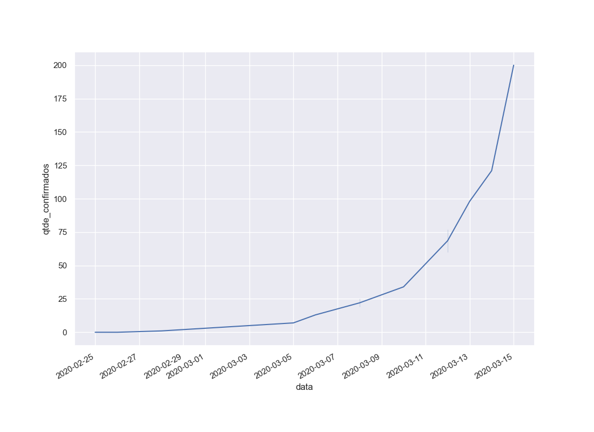

# COVID-19 

Esse repositório é um rascunho de análises feitas com dados epidemiológicos do covid19.

O comportamento dos casos catalogados até agora é esse:

Os dados estão em `data/ministerio_saude.csv` e a fonte deles é o [site oficial do Ministério](http://plataforma.saude.gov.br/novocoronavirus/). Infelizmente, os protocolos atuais não permite uma granularidade maior de dados, pois os hospitais podem demorar até 24h para reportar formalmente.

Novas fontes de dados serão adicionadas em breve.